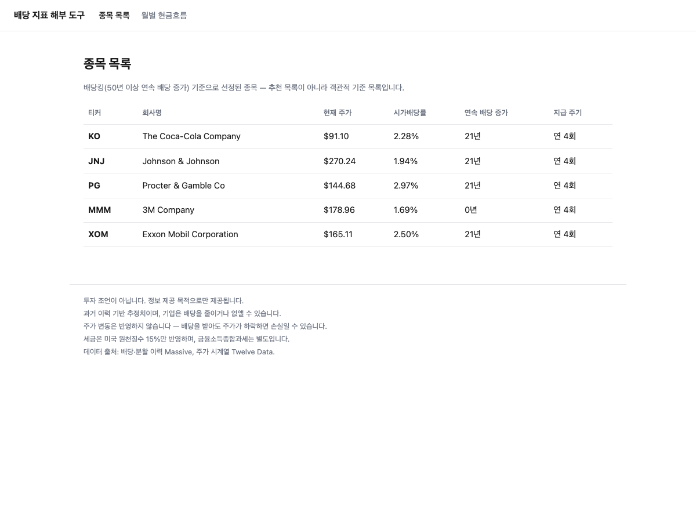
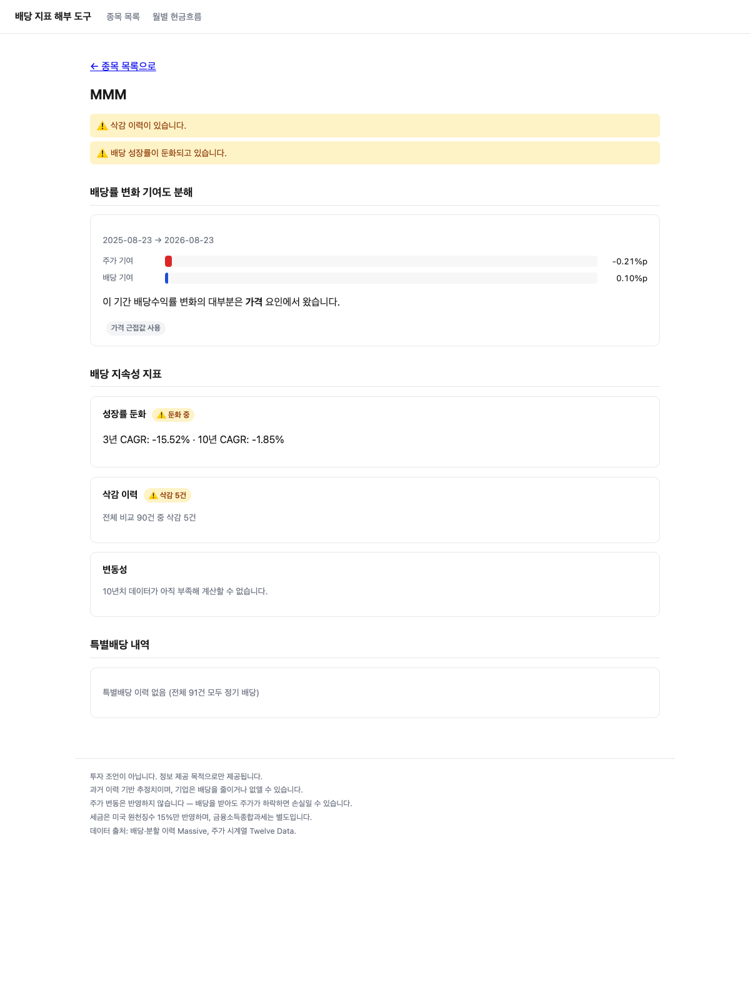
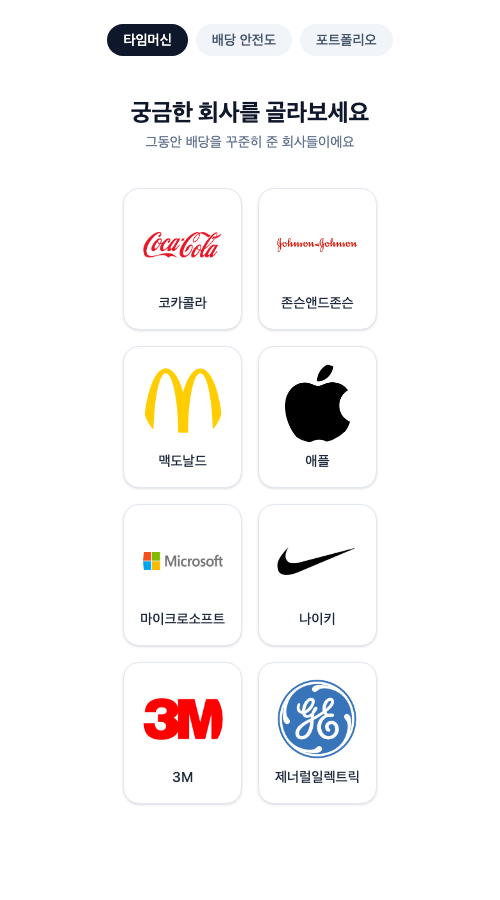
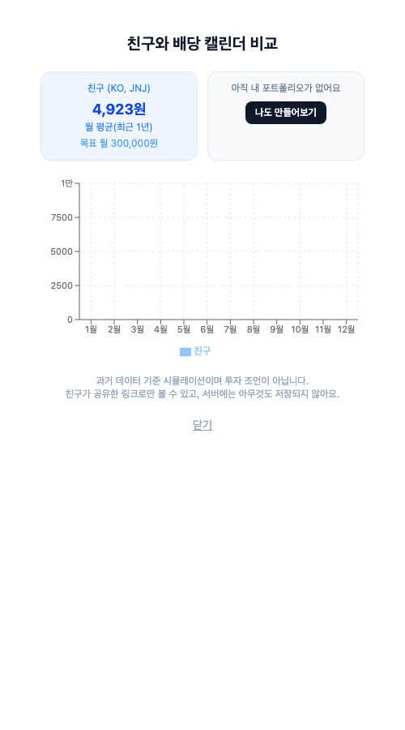

# 배당 지표 해부 도구

배당 종목의 숫자가 **어디서 왔는지 분해해서** 보여주는 도구. 숫자를
보여주는 계산기가 아니라, 숫자를 읽는 법을 알려주는 도구.

## 1. 무엇을 만들었나

미국 배당킹 종목의 배당률·성장률·변동성을 실제 배당·주가·환율
데이터로 계산해서 보여주는 API + 화면.

**종목 목록** — 현재가, 시가배당률, 연속 배당 증가 연수를 한눈에.
배당킹 57개 종목 전체를 대상으로 하며, 알트리아(MO, 6.19%)·유니버설(UVV,
7.14%)처럼 실제로 시가배당률이 높은 종목엔 "⚠️ 확인 필요" 경고가 자동으로
붙는다 — 2장이 예로 든 "배당률 급등이 위험 신호일 수 있다"는 상황이
실제 데이터에서 나온 사례다.



**종목 상세 — 지표 해부** — 배당수익률 변화를 가격 기여/배당 기여로
분해하고, 성장률 둔화·삭감 이력·변동성을 실제 데이터로 판정한다.
아래는 3M(MMM)의 실제 화면 — 2024년 Solventum 스핀오프로 분기 배당이
$1.51→$0.70으로 실제로 줄어든 것을 계산기가 정확히 잡아낸 사례다.



**월별 예상 현금흐름** — 보유 수량을 입력하면 최근 12개월 실제 지급
이력 기준으로 월별 수령액을 계산(세전/세후, USD/KRW 토글).

**의도적으로 뺀 것**: 배당성향(이익 대비 배당 비율)은 구현하지 않았다.
재무제표 데이터를 주는 Finnhub까지 붙이면 이미 감수하고 있는 두 제공자
(Massive·Twelve Data)의 약관 리스크에 세 번째를 더 얹는 셈인데, 얻는
가치(숫자 하나)에 비해 그 리스크와 새 파이프라인 비용이 안 맞는다고
판단했다(`docs/decisions/09-payout-ratio-descoped.md`).

## 2. 왜 만들었나

배당 투자를 시작하려는 초보는 "얼마 들어오는지", "언제 들어오는지",
"세금이 얼마인지"는 기존 서비스로 다 해결된다. 그런데 **"이 배당률이
왜 이런지"는 거의 아무도 설명해주지 않는다.**

배당률 = 배당금 ÷ 주가라서, 주가가 반토막 나면 배당률은 두 배로
뛴다. 초보는 이걸 "고배당 우량주"로 오독하고 매수했다가 배당 삭감과
추가 주가 하락을 함께 겪는다. 이 도구는 그 함정 하나를 정면으로
다룬다 — "배당률 8%가 배당이 늘어서인지, 주가가 떨어져서인지"를
숫자로 쪼개서 보여준다.

## 3. 핵심 계산 로직 — 배당률 변화 기여도 분해

배당수익률 변화(`ΔY = Y(t1) - Y(t0)`)를 가격 요인과 배당 요인으로
나눈다. "가격만 먼저 바뀌었다고 가정" / "배당만 먼저 바뀌었다고
가정" 두 순서를 평균 내는 대칭 분해를 쓴다 — 어느 쪽이 "먼저"인지
정할 근거가 없는데 순차 분해를 쓰면 그 임의성이 결과에 그대로
섞이기 때문이다.

```
가격 기여도 = (D0 + D1) / 2 * (1/P1 - 1/P0)
배당 기여도 = (D1 - D0) / 2 * (1/P0 + 1/P1)

항등식(테스트로 고정): 가격 기여도 + 배당 기여도 == ΔY
```

이 위에 세 가지 지속성 지표(성장률 둔화, 삭감 이력, 변동성)를 더해서
"배당률 하나"가 아니라 "그 배당률을 만든 배경"을 보여준다. 전체
계산은 `BigDecimal`만 쓴다 — 환율까지 곱해지는 계산이라 부동소수점
오차가 실제로 드러나서, ArchUnit이 도메인 패키지의 `double`/`float`
사용을 빌드 타임에 막는다.

## 4. AI를 어떻게 통제했나

### 워크플로우 설계

반복 단위("지표 하나 추가하기")를 식별해 9단계로 고정했다:
`/spec → 예측 → /test → plan → 구현 → 검증(hooks) → 실데이터 검증 →
기록 → /clear`. 7단계("실데이터 검증")는 원래 8단계였던 걸 도중에
추가한 것 — 테스트 59개가 전부 통과한 상태에서도 실제 API 호출로만
드러난 TTM 창 버그를 겪고 나서다(`docs/ai-defects/04`). 전체 과정은
`docs/workflow.md`.

### 실패 예측

지표를 구현하기 **전에** "AI가 이걸 틀릴 것이다"를 25개 적어뒀다.
24개는 틀렸다(AI가 실제로는 그 실수를 안 함) — 스펙 단계에서 미리
걸렀기 때문이다. 1개는 맞았다: Spring Boot 4.1(2026-06 출시, 학습
데이터 비중이 낮음)의 API를 3.x 시절 감각으로 세 번 반복해서 잘못
생성했다(스타터 모듈 분리, Jackson 3 groupId 변경, `RestClient`
스타터 분리). 전체 기록은 `docs/ai-predictions.md`.

### 도입하지 않은 것

서브에이전트, Skills, 멀티 에이전트 오케스트레이션, 자체 MCP 서버,
GitHub Actions 자동 리뷰 — 전부 안 썼다. 이 프로젝트는 반복 작업
단위가 "지표 추가" 하나뿐이라 오케스트레이션 이득이 없고, 지침도
CLAUDE.md 한 페이지로 충분해 Skills로 쪼갤 이유가 없었다. 안 쓴
이유와 근거는 `docs/decisions/00-ai-harness.md`.

## 5. 배운 것

- **테스트가 전부 통과해도 실데이터로 검증하기 전엔 끝난 게 아니다.**
  TTM 창 경계 버그는 59개 테스트를 전부 통과한 상태에서 실제 API
  호출로만 드러났다 — 그래서 워크플로우에 7단계를 새로 추가했다.
- **AI가 실제로 놀라운 사실을 발견하기도 한다.** 목록 화면에서
  KO·JNJ·PG·XOM이 전부 "연속 배당 증가 21년"으로 똑같이 나와서
  버그로 의심했는데, 확인해보니 네 종목 다 데이터 커버리지가
  2003~2004년부터라 생기는 구조적으로 동일한 결과였다. MMM이
  "0년"으로 나온 것도 버그가 아니라 2024년 실제 스핀오프 배당 삭감
  이벤트였다 — 계산기가 사람의 첫 직관보다 정확했던 사례다.
- **"AI가 틀릴 것"을 사전에 예측할 수 있다는 것 자체가 도메인을
  이해했다는 증거다.** 사후 회고면 "정리했다"에 그치지만, 구현 전에
  적어두면 "왜 그렇게 틀릴 거라 생각했는지"를 설명할 수 있다.
- **데이터 커버리지의 한계는 계산 버그와 다르다.** KO의 실제
  연속 배당 인상 역사는 60년이 넘지만, 우리 DB는 2003년부터만
  갖고 있어 계산상 스트릭은 21년으로 나온다. 계산 자체는 정확하고,
  "무엇을 정확히 계산했는가"를 착각하지 않는 게 중요했다.

## AI 판단 기록표

| AI가 자연스럽게 갔을 방향 | 왜 안 받아들였나 | 대신 어떻게 했나 |
|---|---|---|
| TTM 창을 양 끝 포함(`[t-12개월, t]`)으로 구현 | 실제 KO 데이터로 인접한 두 창이 겹쳐 이중 계산됨을 발견 | 시작점 제외(`(t-12개월, t]`)로 수정, 이후 캘린더 드리프트까지 추가 발견해 `annualizedSum` 정규화 도입 |
| 정기/특별배당 분류를 지급 이력에서 직접 추론하는 알고리즘 설계 | Massive가 `dividend_type`/`frequency` 필드로 이미 분류해서 내려주는 걸 실제 API 호출로 확인 | 자체 추론 로직을 만들지 않고 제공자 필드를 신뢰(알 수 없는 코드는 예외로 드러냄) |
| `payDate`가 없는 지급 건은 `exDividendDate`로 대체해서 환율 조회 | CLAUDE.md의 "환율은 지급일 기준" 원칙을 조용히 어기게 됨 | 환산 불가로 명시 처리(`PAY_DATE_MISSING`), 다른 날짜로 대체하지 않음 |
| 분할 조정 로직을 `TtmDividendAggregationService` 안에 있는 그대로 복제해서 연속 증가 연수 계산에도 사용 | 분할 조정은 이미 한 번 버그가 났던 지점이라 복제하면 같은 버그를 두 번 만들 위험 | `SplitAdjustmentCalculator`로 추출해 공유, 기존 테스트로 회귀 없음 확인 |
| 모바일 화면에서 카드가 잘려 보여서 CSS 레이아웃 버그로 진단, `min-w-0`·grid→flex 전환 등 5차례 수정 시도 | 수정을 몇 번 갈아엎어도 스크린샷이 바이트 단위로 똑같아서 "CSS가 원인이 아니다"로 가설을 뒤집음. `window.innerWidth`를 직접 찍어보니 헤드리스 Chrome이 `--window-size` 요청과 무관하게 항상 500px로 레이아웃하고 스크린샷 파일만 요청 크기로 잘라내고 있었다 — 테스트 도구의 버그였지 앱 버그가 아니었음 | 코드 수정을 전부 되돌리고, 스크린샷 도구의 window-size를 실제 렌더 폭(500px)에 맞춰 재검증. **"고쳐지지 않는 버그"는 진단 자체가 틀렸다는 신호일 수 있다는 걸 실제로 겪은 사례** |

---

## 배포

개인 OCI 계정의 k3s 클러스터(Always Free Ampere ARM64)에 새
워크로드로 배포했다 — 새 인스턴스를 만들지 않고 기존 클러스터의
여유 용량을 쓴 이유, 이미지 사이드로드 방식, 배포 중 발견한 클러스터
크로스노드 네트워킹 문제와 우회는 `docs/decisions/08-deployment.md`
참고. TLS 없음(HTTP 평문, 데모 목적) — 기존 클러스터 워크로드와 동일
수준.

## 기술 스택

Java 21 · Spring Boot 4.1 · MySQL(OCI) · JUnit + AssertJ + ArchUnit ·
vanilla JS(빌드 도구 없음). 배당·분할 이력은 Massive, 주가·환율
시계열은 Twelve Data(`docs/decisions/01-data-source.md`,
`docs/decisions/07-fx-data-source.md`).

## 고지 사항

투자 조언이 아닙니다. 과거 이력 기반 추정치이며, 주가 변동은
반영하지 않습니다. 세금은 미국 원천징수 15%만 반영합니다. 전체
문구는 각 화면 하단 참고.

---

## 배당연습장 — 같은 계산 엔진 위에 올린 두 번째 프로덕트

위 도구를 완성한 뒤, 같은 백엔드·계산 엔진을 그대로 두고 **"숫자를
보여주는 것"에서 "숫자를 확인하는 습관을 만드는 것"으로** 방향을
넓힌 두 번째 프로덕트. 상세 기획은
[`배당연습장_기획서_통합본.md`](배당연습장_기획서_통합본.md), 진행
과정은 `docs/progress-log.md`의 "배당연습장 피벗" 절 참고.

### 무엇을 만들었나

- **타임머신 시뮬레이터** — 유명 브랜드(코카콜라·존슨앤드존슨·애플 등)를 골라
  "재투자했다면 지금 얼마?"를 실제 배당·주가 데이터로 계산. 배당 삭감
  사례(3M·GE)도 균형 있게 포함.
- **배당 안전도 스코어** — 배당성향·FCF 대비 배당·ROE·부채비율·이자보상배율
  5개 지표를 Simply Safe Dividends·워런 버핏 등 실제 문헌 기준으로
  0~100점 합산, 신호등 색상 + 지표별 풀어보기 + 연도별 배당금 추이까지
  3단계로 공개.
- **모의 포트폴리오 빌더** — 목표 월 배당액 입력 → 종목 검색해 직접 담기
  → 최근 12개월 실적 기준 현금흐름·목표 달성률. 세전/세후 토글, 다음
  배당 카운트다운, 완화된 DCA 스트릭(하루 한 번 확인만 해도 인정),
  친구에게 캘린더 공유(URL 하나로, 서버 저장 없음)까지 포함.





**의도적으로 뺀 것**: 기획서가 요구한 "인기 포트폴리오 프리셋 3종"은
넣지 않았다. 여러 종목을 묶어 조합으로 제시하는 건 자본시장법상
투자자문업 경계에 더 가깝고, 회원가입·서버 저장이 없어 "인기"를
정직하게 계산할 방법 자체가 없었다. Go/No-Go 트래킹과 프리미엄 구독도
이번 스코프에서는 건너뛰었다 — 코드가 아니라 사업 판단이 먼저 필요한
영역이라서다.

### 배포 아키텍처 — 원래 도구와 다르게 간 이유

백엔드(계산 엔진)는 원래 도구와 완전히 같은 Spring Boot 앱에 API만
증분 추가했다. 프론트는 React(Vite)로 새로 짜고 **Vercel에 독립
배포**했다 — 처음엔 "기존 Docker 이미지 안에 같이 넣는다"는 계획으로
시작했다가, 짜고 보니 백엔드가 평문 HTTP로만 열려 있어 HTTPS
프론트에서 직접 호출하면 브라우저 mixed-content 정책에 막힌다는 걸
뒤늦게 발견했다. Vercel의 서버사이드 `rewrites`로 `/api/*`를
프록시하는 쪽으로 다시 설계해 이 문제를 근본적으로 없앴다 — 전체
과정은 [`docs/portfolio/03`](docs/portfolio/03-frontend-deployment-architecture.md).

### 기술 스택 (추가분)

React 19 · Vite · TypeScript · Tailwind CSS 4 · Recharts · Framer
Motion. 상태는 별도 상태관리 라이브러리 없이 컴포넌트 로컬
`useState`로 충분했고, 회원가입이 없는 기능(DCA 스트릭, 내 포트폴리오
기억)만 기기별 `localStorage`를 썼다.
